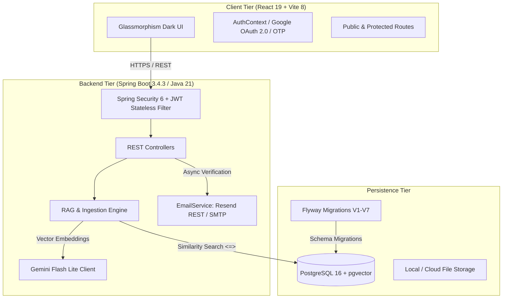

# AiProf — AI-Powered Personal Learning Companion

[](https://openjdk.org/projects/jdk/21/)
[](https://spring.io/projects/spring-boot)
[](https://react.dev/)
[](https://vitejs.dev/)
[](https://github.com/pgvector/pgvector)
[](https://ai.google.dev/)
[](https://ai-prof-study-companion.vercel.app)

> **AiProf** is an intelligent, full-stack educational study companion engineered for university students, educators, and lifelong self-directed learners. It transforms unstructured course documents (lecture notes, textbooks, slides) into interactive, grounded AI tutoring sessions, adaptive practice quizzes, and cognitive concept mastery models.

🌐 **Live Application**: [https://ai-prof-study-companion.vercel.app](https://ai-prof-study-companion.vercel.app)

---

## 📑 Table of Contents
1. [Core Features](#-core-features)
2. [System Architecture](#-system-architecture)
3. [Technology Stack](#-technology-stack)
4. [Project Structure](#-project-structure)
5. [Local Development Quick Start](#-local-development-quick-start)
6. [Database Schema & Migrations](#-database-schema--migrations)
7. [API Endpoints Reference](#-api-endpoints-reference)
8. [Environment Configuration](#-environment-configuration)
9. [Security & Production Readiness](#-security--production-readiness)

---

## 🚀 Core Features

### 1. Hierarchical Knowledge Architecture
- **Learning Spaces**: High-level academic containers (e.g., *"Computer Science 2026"*, *"Biochemistry Tri-2"*).
- **Projects**: Topic-focused modules with specific learning goals, target deadlines, and progress analytics.
- **Document Materials**: Drag-and-drop ingestion of course slides, PDFs, DOCX, TXT, and Markdown files.

### 2. Retrieval-Augmented Generation (RAG) with `pgvector`
- Ingested study materials are parsed, segmented into semantic text chunks (400 tokens with 50 token overlap), and converted to 3072-dimensional vector embeddings using Google Gemini (`gemini-embedding-001`).
- Similarity searches execute native cosine distance queries (`<=>`) directly within PostgreSQL via indexed vector columns.

### 3. Socratic AI Tutoring with Grounded Citations
- Unlike generic chatbots, AiProf acts as an expert academic tutor using dialogic questioning to stimulate critical thinking and uncover student misconceptions.
- Strictly adheres to the project's source material and provides clickable, excerpt-grounded citations for every factual claim.
- **Empty Materials Gate**: Prevents ungrounded hallucination by requiring at least one course document to be uploaded before tutor sessions can begin.

### 4. Adaptive Quizzing & Spaced Repetition Mastery
- AI generates multi-format diagnostic quizzes (Multiple Choice, True/False, Short Answer) directly from course materials.
- Tracks granular per-concept mastery percentages ($0\% - 100\%$) across time.
- Identifies weak knowledge areas and serves dynamic **Targeted Mastery Recommendations** on the student's dashboard.

### 5. Enterprise-Grade Authentication & Security
- **Dual Authentication**:
  - **Google OAuth 2.0 Sign-In**: One-click authentication with Google Identity Services (GIS) and backend ID token verification.
  - **Email + Password**: BCrypt salted hashing with mandatory 6-digit Email OTP verification.
- **Resilient Email Delivery**: Primary delivery through Resend REST API (HTTPS port 443 — cloud-firewall immune) with automatic fallback to standard Gmail SMTP.
- **Role-Based Access Control (RBAC)**: Strict role separation between `USER` and `ADMIN` with route guards and an administrative telemetry dashboard.

---

## 🏛 System Architecture



---

## 🛠 Technology Stack

### Backend
- **Language**: Java 21 (Eclipse Temurin LTS)
- **Framework**: Spring Boot 3.4.3
- **Security**: Spring Security 6.4, JJWT (0.12.6) HMAC-SHA256
- **Persistence**: Spring Data JPA, Hibernate 6.6
- **Database Migrations**: Flyway 10.20
- **AI Integration**: Google Gemini API (`gemini-flash-lite-latest`, `gemini-embedding-001`)
- **Vector Operations**: PostgreSQL `pgvector-java` (0.1.6)
- **Document Processing**: Apache Tika (PDF/DOCX/TXT/MD extraction)
- **Build Tool**: Apache Maven (Wrapper included)

### Frontend
- **Library**: React 19.0
- **Build Tool**: Vite 8.3 (Rolldown / LightningCSS enabled)
- **Routing**: React Router 7.2
- **Icons**: Lucide React
- **Data Visualization**: Chart.js 4.4 + `react-chartjs-2`
- **Notifications**: React Hot Toast
- **Styling**: Vanilla CSS Design System (Custom tokens, glassmorphism, responsive grid)

### Infrastructure & Database
- **Database**: PostgreSQL 16 with `vector` extension (Neon Cloud DB in production)
- **Frontend Hosting**: Vercel (Edge CDN)
- **Backend Hosting**: Docker Container (Render / Cloud Container Service)

---

## 📂 Project Structure

```
AiProf/
├── backend/
│   ├── Dockerfile                           # Multi-stage container build (Temurin 21 JRE)
│   ├── pom.xml                              # Maven configuration & dependencies
│   ├── mvnw / mvnw.cmd                      # Cross-platform Maven wrapper
│   └── src/main/
│       ├── java/com/aiprof/studycompanion/
│       │   ├── common/                      # ApiResponse wrapper & GlobalExceptionHandler
│       │   ├── config/                      # Web, Async, AI, & RestTemplate configurations
│       │   ├── controller/                  # REST API Controllers (Auth, Spaces, Quiz, Tutor, Admin)
│       │   ├── dto/                         # Request/Response Data Transfer Objects
│       │   ├── entity/                      # JPA Entities (User, Space, Project, Material, Chunk)
│       │   ├── repository/                  # Spring Data Repositories with native vector queries
│       │   ├── security/                    # JWT Filter, Token Provider, UserDetailsService
│       │   └── service/                     # Core business logic (RAG, Gemini AI, Email, Ingestion)
│       └── resources/
│           ├── application.yml              # Central Spring Boot configuration
│           └── db/migration/                # Versioned Flyway SQL migrations (V1 through V7)
├── frontend/
│   ├── package.json                         # Node.js dependencies and build scripts
│   ├── vite.config.js                       # Vite configuration with local proxy
│   ├── vercel.json                          # Vercel SPA routing rewrite rules
│   └── src/
│       ├── api.js                           # Axios API client with automatic JWT bearer interception
│       ├── App.jsx                          # Route definitions & public/protected route guards
│       ├── index.css                        # Design tokens, color ramps, ambient blur effects
│       ├── components/                      # Reusable UI components (Modal, Navbar, GoogleSignIn)
│       ├── context/                         # AuthContext state management
│       └── pages/                           # Application views (Dashboard, Spaces, Tutor, Quiz, Admin)
├── .env.example                             # Root environment variable template
├── docker-compose.yml                       # Local PostgreSQL 16 + pgvector container
└── README.md                                # Project documentation
```

---

## 💻 Local Development Quick Start

### Prerequisites
- **JDK 21** or higher (`java -version`)
- **Node.js 20** or higher & **npm** (`node -v`)
- **Docker Desktop** (for running PostgreSQL with pgvector locally)

---

### Step 1: Clone the Repository
```bash
git clone https://github.com/sathwik1821/Ai-Prof-Study-Companion.git
cd Ai-Prof-Study-Companion
```

---

### Step 2: Start PostgreSQL with pgvector
Use the provided `docker-compose.yml` to launch a pre-configured PostgreSQL 16 database with the `pgvector` extension enabled:

```bash
docker compose up -d
```
*The database will start on `localhost:5432` with user `postgres` and password `postgres`.*

---

### Step 3: Configure Environment Variables
Copy `.env.example` to `.env` in the root folder:

```bash
# On macOS / Linux:
cp .env.example .env

# On Windows PowerShell:
Copy-Item .env.example .env
```

Open `.env` and configure your keys:
```properties
# Required for AI Features:
GEMINI_API_KEY=your-gemini-api-key-here

# Optional: Google OAuth 2.0 Client ID (Included default works for localhost:5173)
VITE_GOOGLE_CLIENT_ID=420129371421-b880kb1kth6j6ge47vo94o9ronn8de31.apps.googleusercontent.com
```

---

### Step 4: Run the Backend Service
Navigate to the `backend/` folder and start the Spring Boot service:

```bash
cd backend

# On macOS / Linux:
./mvnw spring-boot:run

# On Windows:
.\mvnw.cmd spring-boot:run
```
Flyway will automatically execute migrations `V1` through `V7`. The backend will be ready at **`http://localhost:8080`**.

---

### Step 5: Run the Frontend Development Server
In a new terminal window, navigate to the `frontend/` directory:

```bash
cd frontend
npm install
npm run dev
```

Open your browser and navigate to: **`http://localhost:5173`**

---

## 🗄 Database Schema & Migrations

The database schema is managed through Flyway migrations located in `backend/src/main/resources/db/migration/`:

| Migration | Name | Description |
| :--- | :--- | :--- |
| `V1` | `init_extensions` | Enables the PostgreSQL `vector` and `uuid-ossp` extensions. |
| `V2` | `core_entities` | Creates `users`, `spaces`, and `projects` tables with foreign keys and indexes. |
| `V3` | `materials_and_jobs` | Creates `materials`, `document_chunks` (with `VECTOR(3072)` embeddings column), and `processing_jobs`. |
| `V4` | `learning_entities` | Creates `concept_mastery`, `conversations`, `chat_messages`, `quizzes`, `quiz_questions`, and `quiz_attempts`. |
| `V5` | `schema_alignment` | Normalizes columns, constraints, and cascade delete rules. |
| `V6` | `refresh_tokens` | Manages persistent JWT refresh tokens with revocation support. |
| `V7` | `email_verification_otp` | Adds `email_verified`, `otp_code`, and `otp_expires_at` columns to `users`. |

---

## 🔌 API Endpoints Reference

### Authentication (`/api/auth`)
- `POST /api/auth/register` — Create account and dispatch 6-digit email OTP.
- `POST /api/auth/verify-otp` — Verify email OTP and receive JWT access token.
- `POST /api/auth/resend-otp` — Request a fresh 6-digit verification code.
- `POST /api/auth/login` — Authenticate with email & password.
- `POST /api/auth/google` — Authenticate with Google OAuth 2.0 ID token.
- `POST /api/auth/refresh` — Issue fresh access token using refresh token.
- `POST /api/auth/logout` — Revoke active tokens and terminate session.
- `GET  /api/auth/me` — Retrieve profile details of the authenticated user.

### Knowledge Spaces & Projects
- `GET    /api/spaces` — List all spaces for the authenticated user.
- `POST   /api/spaces` — Create a new learning space.
- `DELETE /api/spaces/{id}` — Delete space and cascade delete all child entities.
- `GET    /api/spaces/{spaceId}/projects` — List projects inside a space.
- `POST   /api/spaces/{spaceId}/projects` — Create a new project.
- `DELETE /api/spaces/{spaceId}/projects/{id}` — Delete a project.

### Study Materials & RAG
- `GET    /api/projects/{projectId}/materials` — List uploaded materials.
- `POST   /api/projects/{projectId}/materials/upload` — Upload PDF/DOCX/TXT and trigger RAG vector ingestion.
- `DELETE /api/materials/{id}` — Delete material and all associated vector chunks.

### Socratic AI Tutor (`/api/tutor`)
- `POST /api/projects/{projectId}/tutor/chat` — Send a prompt; returns grounded Socratic response with source citations.
- `GET  /api/projects/{projectId}/tutor/history` — Retrieve past tutoring conversation turns.

### Adaptive Quizzes (`/api/quizzes`)
- `POST /api/projects/{projectId}/quizzes/generate` — Generate dynamic diagnostic quiz from uploaded materials.
- `GET  /api/quizzes/{quizId}` — Fetch quiz questions.
- `POST /api/quizzes/{quizId}/submit` — Submit quiz answers, compute score, and update concept mastery.

### Analytics & Telemetry
- `GET /api/analytics/overview` — Aggregated mastery scores, recent activity, and Targeted Mastery recommendations.
- `GET /api/admin/overview` — System health, active users, background queue jobs, and LLM token usage *(Admin only)*.

---

## ⚙ Environment Configuration

| Variable | Description | Default / Example | Required |
| :--- | :--- | :--- | :---: |
| `DATABASE_URL` | JDBC URL for PostgreSQL database | `jdbc:postgresql://localhost:5432/study_companion` | Yes |
| `DATABASE_USERNAME` | Database username | `postgres` | Yes |
| `DATABASE_PASSWORD` | Database password | `postgres` | Yes |
| `GEMINI_API_KEY` | Google AI Studio API Key for embeddings and chat | `AIzaSy...` | Yes |
| `JWT_SECRET` | HMAC-SHA256 signing secret (min 256 bits) | `your-256-bit-secret` | Yes |
| `JWT_EXPIRATION_MS` | Access token lifespan in milliseconds | `86400000` (24h) | No |
| `RESEND_API_KEY` | Resend REST API Key (HTTPS port 443 email delivery) | `re_...` | Optional |
| `SPRING_MAIL_USERNAME` | Gmail SMTP username (Port 587 fallback) | `user@gmail.com` | Optional |
| `SPRING_MAIL_PASSWORD` | Gmail SMTP App Password | `xxxx-xxxx-xxxx-xxxx` | Optional |
| `VITE_GOOGLE_CLIENT_ID` | Google OAuth 2.0 Web Client ID | `*.apps.googleusercontent.com` | Optional |

---

## 🔒 Security & Production Readiness

- **Zero Hardcoded Secrets**: All API keys, passwords, and tokens are injected strictly via environment variables.
- **Stateless Session Security**: JWT authentication with automatic Bearer token extraction and cryptographic signing verification.
- **RAG Grounding & Hallucination Prevention**: Strict system prompts compel the LLM to refuse answering questions outside the scope of uploaded course materials.
- **Database Cascade Deletion**: Foreign key constraints specify `ON DELETE CASCADE` across all child relationships, ensuring complete referential integrity.
- **CORS & Origin Hardening**: Spring Security restricts cross-origin resource sharing to authorized production and local development origins.

---

## 👥 Authors & Acknowledgments

- **Lead Developer**: Sathwik Bodakunta ([@sathwik1821](https://github.com/sathwik1821))
- **Powered By**: Google Gemini Flash Lite, Spring Boot, React, and PostgreSQL pgvector.
